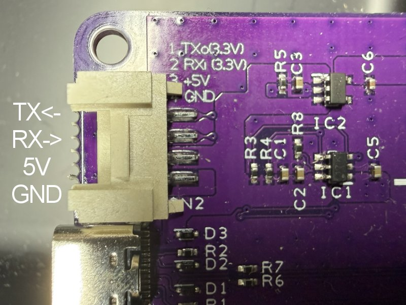

# MSXPLAYer Game Cassette Adapterコマンド仕様  

## 共通仕様

- 1行 = 1コマンド（`,`区切り）
- フォーマット（最大4引数）:

  ```CMD
  CMD[,ARG1[,ARG2[,ARG3[,ARG4]]]]<CR|LF|CRLF>
  ```

- コマンド名は大文字小文字を区別しません（内部で大文字化）
- 引数は基本 **16進数**（`0x` プレフィクス可）
- 未指定引数は、デフォルト動作になります。
- 戻り値:
  - 通常は処理結果として最後に `OK` / `FAIL` を返します
  - `ERROFF` 中は OK/FAIL 表示を抑止し、成功/失敗カウントのみ更新します

## コマンド一覧（仕様書形式・実装準拠）

### 1) HSET - Hardware Setting（ダミー/未実装）

- **機能**: ハード設定（現状はダミー）
- **書式**: `HSET,[Address],[Data]`
- **引数**:
  - `Address` : 設定対象アドレス（16進）
  - `Data` : 設定値（16進）
- **応答**: `OK`
- **備考**: 現状は実動作なし。将来拡張用。

---

### 2) ERROFF - Result display OFF

- **機能**: コマンド実行結果の逐次表示（OK/FAIL表示）を抑止する
- **書式**: `ERROFF`
- **引数**: なし
- **応答**: `OK`
- **備考**:
  - 有効時は `passCount/errCount` で統計を蓄積
  - 大量処理（転送・スクリプト）時のログ抑制に利用

---

### 3) ERRON - Result display ON + summary

- **機能**: `ERROFF` を解除し、抑止期間の集計を表示する
- **書式**: `ERRON`
- **引数**: なし
- **応答**:
  - `PASS : <passCount>`
  - `FAIL : <errCount>`
  - その後、失敗があれば `FAIL`、なければ `OK`
- **備考**:
  - `FAIL` があった場合は `ERRON` 自体が `FAIL` で返る仕様

---

### 4) BCLR - Buffer Clear（slotMem 初期化）

- **機能**: 内部バッファ（64KB）を指定値で埋める
- **書式**: `BCLR(,[BufferAddress],[Length],[Data])`
- **引数**:
  - `BufferAddress` : 開始位置（省略時 0）
  - `Length` : 長さ（省略時 64KB相当）
  - `Data` : 埋め値（省略時 `0xFF`）
- **応答**: `OK` / `FAIL`
- **備考**:
  - 範囲外指定は `FAIL`
  - 長さはバッファ境界に合わせて補正される場合がある

---

### 5) BSND - Buffer Send Host（Device→Host バイナリ送信）

- **機能**: 内部バッファのデータをPCへ送信する（バイナリ）
- **書式**: `BSND,[BufferAddress],[Length]`
- **引数**:
  - `BufferAddress` : 送信開始位置
  - `Length` : 送信バイト数
- **応答**:
  - バイナリデータがPCに送信されます。
  - その後に `OK/FAIL`（displayFlag=true時）が送信されます。
- **備考**:

---

### 6) BRCV - Buffer Receive Host（Host → Device バイナリ受信）

- **機能**: PCから指定長のバイナリを受信し、`slotMem[]` に格納する
- **書式**: `BRCV,[BufferAddress],[Length]` +（続けて Length バイトのバイナリ本体）
- **引数**:
  - `BufferAddress` : 格納開始位置
  - `Length` : 受信バイト数
- **応答**:
  - 受信完了後に `OK/FAIL`
- **備考**:
  - `BRCV` 実行後直後はバイナリ受信モードへ移行します
  - 範囲外（`BufferAddress + Length` が64KB超）などは `FAIL`

---

### 7) HVER - Hardware Version

- **機能**: ハード名・リビジョン・ビルド日を表示
- **書式**: `HVER`
- **引数**: なし
- **応答**:
  - `HW_NAME`
  - `HW_VERSION`
  - `FIRMWARE DATE`
  - `OK`
- **備考**:
  - `HW_NAME`：カードリーダの名称
  - `HW_VERSION`：HWのVersion
  - `FIRMWARE DATE`:FWのリリース日

---

### 8) HINF - Hardware Information

- **機能**: ハード構成情報の表示
- **書式**: `HINF`
- **引数**: なし
- **応答**: 各種 `KEY,VALUE` 行 + `OK`
- **備考**:
  - `SLOTNUM`: Readerのスロット数  
    Readerについている物理スロット数を表します(1～4)
  - `SLOTPHY`: Readerの物理スロット配置情報  
    Readerについている物理スロットの配置を示します。(1が有効)

    |bit7-4|bit3|bit2|bit1|bit0|
    |---|---|---|---|---|
    |0000|SLOT3|SLOT2|SLOT1|SLOT0|

    例：SLOTNUM:1 / SLOTPHY:2 = 付いているスロット1つでSLOT1扱い  

  - `POWERCTRL`: 電源制御有無  
    カセットに対する電源制御の有無を示します。(1で有り)  
  - `CURRENTSENSOR`: 過電流制御有無  
    カセットに対する過電流検知回路の有無を示します。(1で有り)  
  - `PWR12V`: +12V/-12V電源の有無  
    カセットに対する+12V/-12Vの有無を示します。(1で有り)  
  - `SLOTCLOCK`: 外部スロットクロックの有無  
    カセットに対する精密な3.58MHzのクロック供給回路の有無を示します。(1で有り)  
  - `LINEOUT`: 音声LineOut有無  
    カセットのSOUND端子の出力回路の有無を示します。(1で有り)  
  - `PSGUNIT`: PSG ユニット有無  
    ReaderにPSG音源相当相当の機能があるか示します。(1で有り)  
  - `LFCR`: 改行コードの設定値  
    入力されているCOMMAND文字列の改行コードの種別を表示しています。(1は、"\n" = 0x0d,0x0a 扱い)  
  - `COMDBG`: UARTからのデバッグ出力設定値  
    1の時はUARTからデバッグ用の出力が出る設定です。  
  - `SCRLOOP`: ScriptモードのLOOP回数の最大設定値  
    ScriptモードのLOOP回数を表示します。初期値は1000回  

---

### 9) HSTS - Hardware Internal Status

- **機能**: 内部状態（主にキュー残数・エラー有無）の表示
- **書式**: `HSTS`
- **引数**: なし
- **応答**:
  - キュー残数相当（`count-1`）を1行表示
  - `OK/FAIL`
- **備考**:
  - 実行したキューにエラーが発生した場合は`FAIL`になります。  

---

### 10) SCHK - Slot Cassette Check

- **機能**: スロット接続状態を表示（Power ON不要）
- **書式**: `SCHK`
- **引数**: なし
- **応答**: `0000/0010/0100/0110` のいずれか + `OK`
- **備考**: 応答値はSLOT3210の順番の文字列です。カセットがさしてあるスロットが1になります。  

---

### 11) SPON - Slot Power ON

- **機能**: スロット電源投入、クロック有効化、RESET制御等の初期化
- **書式**: `SPON`
- **引数**: なし
- **応答**: `OK/FAIL`
- **備考**:
  - 過電流発生時は `FAIL`になります。  

---

### 12) SPOFF - Slot Power OFF

- **機能**: スロット電源断、信号を安全状態へ戻す
- **書式**: `SPOFF`
- **引数**: なし
- **応答**: `OK/FAIL`
- **備考**:

---

### 13) SRST - Slot Reset

- **機能**: スロットRESET信号をトグルしてリセットする
- **書式**: `SRST`
- **引数**: なし
- **応答**: `OK`

---

### 14) SSEL - Slot Select

- **機能**: デフォルトスロット番号を設定
- **書式**: `SSEL,[Slot]`
- **引数**:
  - `Slot` : `1` または `2`
- **応答**: `OK/FAIL`
- **備考**:
  - `Slot` 未指定は `FAIL`
  - 以後、Slot省略時にこの値が使われる

---

### 15) SMRD - Slot Memory Read（1 byte）

- **機能**: スロットメモリから1バイト読み出す
- **書式**: `SMRD,[Address](,[Slot])`
- **引数**:
  - `Address` : 0000〜FFFF　スロットメモリアドレス
  - `Slot` : 1 or 2（省略時はdefaultSlot）
- **応答**:
  - `<addr> : <data>`（例 `1000 : 3F`）+ `OK/FAIL`

---

### 16) SMWR - Slot Memory Write（1 byte）

- **機能**: スロットメモリへ1バイト書き込む
- **書式**: `SMWR,[Address],[Data](,[Slot])`
- **引数**:
  - `Address` : 0000〜FFFF　スロットメモリアドレス  
  - `Data` : 00〜FF　書き込みデータ  
  - `Slot` : 1 or 2（省略時defaultSlot）
- **応答**: `OK/FAIL`

---

### 17) SMTR - Slot → Buffer Transfer Read（一括Read）

- **機能**: スロットからバッファーへ連続読み出し
- **書式**: `SMTR,[Address](,[Length],[BufferAddress],[Slot])`
- **引数**:
  - `Address` : 0000〜FFFF　スロット側開始アドレス
  - `Length` :  0000〜FFFF　読み込み長（省略時最大）
  - `BufferAddress` :  0000〜FFFF　バッファー格納開始位置（省略時0）
  - `Slot` : 1 or 2（省略時defaultSlot）
- **応答**: `OK/FAIL`

---

### 18) SMTW - Buffer → Slot Transfer Write（一括Write）

- **機能**: バッファーからスロットへ連続書き込み
- **書式**: `SMTW,[Address],[Length],[BufferAddress](,[Slot])`
- **引数**:
  - `Address` :  0000〜FFFF　スロット側開始アドレス
  - `Length` :  0000〜FFFF　書き込み長
  - `BufferAddress` : バッファー 読み出し開始位置
  - `Slot` : 1 or 2（省略時defaultSlot）
- **応答**: `OK/FAIL`

---

### 19) IORD - IO Read（1 byte）

- **機能**: IOポートから1バイト読み出す
- **書式**: `IORD,[IO]`
- **引数**:
  - `IO` :  0000〜FFFF　IOアドレス（16bit扱い）
- **応答**:
  - `<io> : <data>` + `OK/FAIL`

---

### 20) IOWR - IO Write（1 byte）

- **機能**: IOポートへ1バイト書き込む
- **書式**: `IOWR,[IO],[Data]`
- **引数**:
  - `IO` :  0000〜FFFF　IOアドレス  
  - `Data` : 00〜FF　書き込みデータ  
- **応答**: `OK/FAIL`

---

### 21) IOTR - IO → Buffer Transfer Read（実装準拠）

- **機能**: IOから連続読み出ししてバッファーへ格納
- **書式**: `IOTR,[IO],[Length],[BufferAddress]`
- **引数（実装準拠）**:
  - `IO` : 0000〜FFFF　開始IOアドレス
  - `Length` :0000〜FFFF　読み出し回数（バイト数）
  - `BufferAddress` : バッファー格納開始位置
- **応答**: `OK/FAIL`

---

### 22) IOTW - Buffer → IO Transfer Write（実装準拠）

- **機能**: バッファーからIOへ連続書き込み
- **書式**: `IOTW,[IO],[Length],[BufferAddress]`
- **引数（実装準拠）**:
  - `IO` : 0000〜FFFF　開始IOアドレス
  - `Length` : 0000〜FFFF　書き込み回数（バイト数）
  - `BufferAddress` : 0000〜FFFF　バッファー読み出し開始位置
- **応答**: `OK/FAIL`

---

### 23) BDMP - Buffer Dump（デバッグ用）

- **機能**: バッファーの内容を HEX+ASCII で表示
- **書式**: `BDMP,[BufferAddress](,[Length])`
- **引数**:
  - `BufferAddress` : 0000〜FFFF　開始位置（省略時0）
  - `Length` : 0000〜FFFF　表示長（省略時128）
- **応答**: ダンプ行 + `OK`

---

### 24) SDMP - Slot Dump（スロットメモリダンプ）

- **機能**: スロットから直接読みながらダンプ表示
- **書式**: `SDMP,[Address](,[Length],[Slot])`
- **引数**:
  - `Address` : 0000〜FFFF　開始アドレス（省略時0）
  - `Length` : 0000〜FFFF　表示長（省略時128）
  - `Slot` : 1 or 2（省略時defaultSlot）
- **応答**: ダンプ行 + `OK/FAIL`

---

### 25) BSCR - Buffer Script Execute（スクリプト実行）

- **機能**: バッファー上のスクリプトを実行する
- **書式**: `BSCR,[BufferAddress](,[Slot])`
- **引数**:
  - `BufferAddress` :  0000〜FFFF　スクリプト先頭（省略時0）
  - `Slot` : 1 or 2（省略時defaultSlot）
- **応答**: `OK/FAIL`
- **備考**:
  - 命令形式は 4byte/命令: `[cmd][addr_hi][addr_lo][data]`
  - スクリプトの詳細は別章を参照

---

### 26) FTEST - Factory Test

- **機能**: 工場向け総合テストの実行
- **書式**: `FTEST`
- **引数**: なし
- **応答**: テストログ + `OK/FAIL`

---

### 27) LEDRDY / LEDPON / LEDACC - LED色設定

- **機能**: LED色（READY/POWER ON/SLOT ACCESS）を RGB で設定
- **書式**:
  - `LEDRDY(,[R],[G],[B])`
  - `LEDPON(,[R],[G],[B])`
  - `LEDACC(,[R],[G],[B])`
- **引数**:
  - `R` `G` `B` : 0x00〜0xFF（省略可。省略時はデフォルト値）
- **応答**: `OK`

---

### 28) SDBGON - Serial Debug Log ON

- **機能**: シリアルポートからのデバッグログ出力を有効化
- **書式**: `SDBGON`
- **引数**: なし
- **応答**: `OK`
- **備考**:
  - シリアル出力が増える分実行速度が低下します。
  - バッファーオーバーフローに注意してください。  
  - シリアルはGrove端子より出力されます。

---

### 29) _FFU - Bootloader起動

- **機能**: FFUモードへの移行、USBブートモードへ移行する
- **書式**: `_FFU`
- **引数**: なし
- **応答**: メッセージ出力後、リブート（以降のOK/FAILは返さない）

---

### 30) LSCR - ScriptモードのLOOP回数の最大値設定

- **機能**: Scriptモードの条件成立待ちのループ回数を設定します。  
- **書式**: `LSCR(,最大LOOP回数)`
- **引数**: 0-0xFFFF (省略時は初期値の1000回)
- **応答**: `OK`

---

## シリアルコマンド例

### 例1: スロットの0x0000〜0x3FFFを読み出してPCへ送信

```CMD_EX1
SPON
SMTR,0000,4000,0000,01
BSND,0000,4000
SPOFF
```

### 例2: PCからバイナリを受信し、0x8000へ書き込み

```CMD_EX2
SPON
BRCV,0000,2000
(ここで 0x2000 バイトのバイナリを送信)
SMTW,8000,2000,0000,01
SPOFF
```

## スクリプトモードについて

バッファーにおいたスクリプトを使うことで、PCとの通信をしないで、
データRead/Write・比較の実行を行うことが出来るモードです。  

## スクリプト形式

- スクリプト形式: [Command],[Address(2Byte)],[DATA]...  
- 1スクリプトは4バイトの固定長です。  

### スクリプトデータ フォーマット

|Address|＋0Byte|＋1Byte|＋2Byte|＋3Byte|
|---|---|---|---|---|
|**DATA**|命令コード|上位アドレス|下位アドレス|データ|

### 命令一覧

|Command|命令名|説明|
|---|---|---|
|0x00|NOP|何もしない|
|0x01|Read Memory|Slotに対してReadを実行|
|0x02|Write Memory|Slotに対してDATAを書き込む (LastDataはDATAで上書きされます)|
|0x03|Read IO|Slotに対してIOを使ったReadを実行します。(LastDataはReadしたDATAになります)|
|0x04|Write IO|Slotに対してIOを使ったWriteを実行します。(LastDataはDATAで上書きされます)|
|0x05|Wait|addressで指定したms時間待機します|
|0x06|Compare|LastDataとdataを比較します、一致したら次の命令はスキップします。|
|0x07|AND|LastData [AND] DATAを計算します、結果が0x00なら次の命令をスキップします。|
|0x08|OR|LastData [OR] DATAを計算します、結果が0x00なら次の命令をスキップします。|
|0x09|XOR|lastData [XOR] DATAを計算します、結果が0x00なら次の命令をスキップします。|
|0x0A|JMP|DATAの値だけ命令をスキップします。（0x00-7F=先命令/0x80-FF=前命令）|
|0xFE|Abort|スクリプト実行を失敗で終了|
|0xFF|End|スクリプト実行を成功で終了|

※ JMP命令は、一定回数(初期値は1000回)同じ場所で実行されるとスクリプト失敗になります。  
当該値は"LSCR"コマンドで変更可能です。  

### スクリプト例

下記のコマンドで実行可能です。

```CMD_BRCV
BRCV,0,20  
(下記バイナリー送付)  
BSCR,0
```

|バイナリー値|Command|説明|
|---|---|---|
|0x02,0x55,0x55,0xaa|[Write Memory]  Address:0x5555 Data:0xaa|0x5555に0xAAの書き込み|
|0x02,0xaa,0xaa,0x55|[Write Memory]  Address:0xaaaa Data:0x55|0xAAAAに0x55の書き込み|
|0x02,0x55,0x55,0xa0|[Write Memory]  Address:0x5555 Data:0xa0|0x5555に0xA0の書き込み|
|0x02,0x40,0x00,0x41|[Write Memory]  Address:0x4000 Data:0x41|0x4000に0x41の書き込み|
|0x01,0x40,0x00,0x00|[Read Memory]  Address:0x4000|0x4000のデータを読み込む|
|0x06,0x00,0x00,0x41|[Compare]  Data:0x40|先ほど読み込んだデータと比較して0x40だったら次の命令はスキップ|
|0x0a,0x00,0x00,0xfe|[JMP] -2|2つ前の命令に戻る(つまり、0x4000が0x40になるまでループする)|
|0xff,0x00,0x00,0x00|End|スクリプト終了|

## デバッグについて

"SDBGON"コマンドを実行する事でGROVE端子(UART)より実行ログを取得できます。  
ただし、当該機能を有効にすると実行時間が遅くなりますので通常は有効にしないでください。  

シリアルポートは3.3Vレベルで配線は下記の様になっています。  


### 出力例

```CMD_DEBUGOUT
BRCV_OK20
SKIP : 0a
BIN End
BSCR,0
0: Write Memory 5555:aa
4: Write Memory 2aaa:55
8: Write Memory 5555:a0
12: Write Memory 4000:41
16: Read Memory 4000:ff
20: Compare ff=41
24: JMP
16: Read Memory 4000:ff
20: Compare ff=41
24: JMP
16: Read Memory 4000:ff
20: Compare ff=41
24: JMP
16: Read Memory 4000:ff
20: Compare ff=41
24: JMP
16: Read Memory 4000:41
20: Compare 41=41
28: End Script(PASS)
```CMD_BRCV
