# MSXPLAYer Game cartridge Adapter  

[for English](./readme_en.md)

USB CDC（仮想COM）で MSX カセットを読み書きするツールです。（MSXPLAYer対応予定）

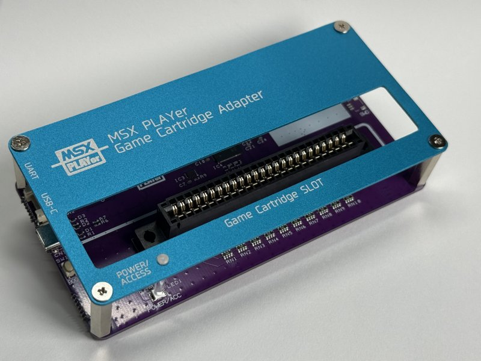

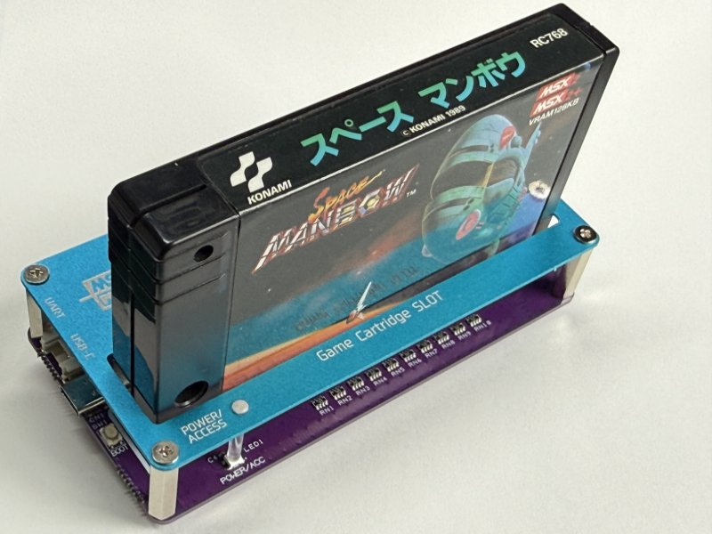

## これは何？

Raspberry Pi 系マイコン（RP2350）を使った **MSX ROM カセット** を読み書きするアダプターです。  
PC から **USB CDC（シリアル）** 経由のコマンドを送ることで下記の事が行えます。

- ROMカセットのRead/Write
- IO Read/Write
- バッファ（64KB）への一括転送、PCへの送受信
- Buffer上の簡易スクリプトによる一括でのスロットアクセス

## 特徴

- **USB CDC（仮想COM）** でコマンド操作（原則ドライバー不要 Windows / Linux / macOS で利用可能）  
- **スロット電源制御・過電流検知機能**を搭載  
- カセットの**メモリおよびIO空間に対するRead/Write**をサポート  
- **クロック信号**をサポート  

- **IO電圧5V対応**
- **ユーザ側での**ファームウェアアップデート可能
- **デュアルコア構成**を活用した低レーテンシー設計  
  - Core0: USB受信・コマンド解析・送信キュー吐き出し  
  - Core1: コマンド実行（GPIOアクセス等）
- **コマンドQueue機能** によりコマンド連続
- **簡易スクリプト**搭載（簡易VM）  

（以下は当方からの頒布品に関して）

- 信頼性が必要なスロットコネクタに **大手メーカ製(AMP/ヒロセ)** 部品を採用

## 実機スロットとの違いについて

実機と異なり下記機能をサポートしていません。  

- +12V/-12Vの電源供給  
- サウンド出力  
- DRAM Refresh信号のサポート  
- M1信号のサポート

## 本体説明

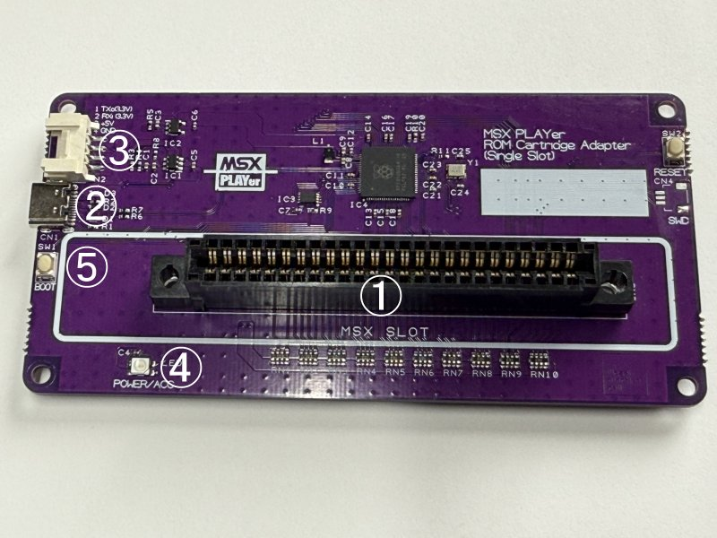

1. MSX SLOT: MSX規格のカセットが挿入します。  
2. USB-C端子: PC本体との接続端子です。  
3. GROVE端子: GROVE仕様の通信端子です。信号の電圧レベルは3.3Vです。現状はデバッグ用のUART信号が出ています。  
4. ACCESS LED: カセットのアクセス状況を示すLEDです。電源供給時およびカセットアクセス時に点灯します。
5. BOOTスイッチ：通常は使用しません。

## [重要] MSXPLAYer対応について

MSXPLAYerの対応は現在、MSX Associationにて進めています。  
当方からの頒布版については、MSXPLAYerが付属予定ですが現段階では未定です。

当面の間は、EarlyAccess版になり、MSXPLAYerを既に持っており、動作チェックに協力いただける、Tester向けの頒布になります。

その為、MSXPLAYerの入手に下記書籍が必要になります。  

**「MSX-BASICでゲームを作ろう　懐かしくて新しいMSXで大人になった今ならわかる」**  
<https://www.amazon.co.jp/dp/4297148900/>
<https://books.rakuten.co.jp/rb/18203653/>  
<https://www.yodobashi.com/product/100000009004112958/>  

こちらで入手したMSXPLAYerにパッチを当てる形で対応を予定しています。  
MSXPLAYer側の不具合発生時の報告用のフォームなども準備中です。  

具体的な対応版入手方法については配布が開始してから追記します。

## OpenMSXなど他プラットフォームの対応について

協力いただける方募集中です。XのDMでご相談いただけると嬉しいです。  

## 頒布について

現在はEarly Access版になります。  
これは、動作チェックや対応ソフトの開発に協力いただける、Tester向けの頒布になります。  
MSXPLAYerは、別途必要になること、将来の正式頒布版と仕様が異なることをご了承できる方のみ購入ください。  

完成させるのには、ドライバーを使った簡単な組み立て作業が必要です。  
コネクターキット版については、スロット部分の簡単な半田付け作業が必要になります。  

### 頒布サイト

スロットが半田付けが必要な半田付けキット版と基板完成版の2種類が用意されます。  
価格については、製造時の世界状況によりしばらくの間大きく変動する可能性が高いです。ご了承ください。  

#### Booth

※2026/5/10 12:00(JPT)～  
<https://ifc.booth.pm/items/8175544>

基板完成版：￥7,060 / 半田付けキット版￥6,560

## 内容物一覧

1. Game cartridge Adapter 基板  
2. 専用アルミパネル  
3. ゴム足
4. スペーサー x 4  
5. ネジ(φ3 x 8mm) x 8  
6. LEDライトパイプ  
7. 50ピンカードエッジコネクタ（半田付けキット版のみ）

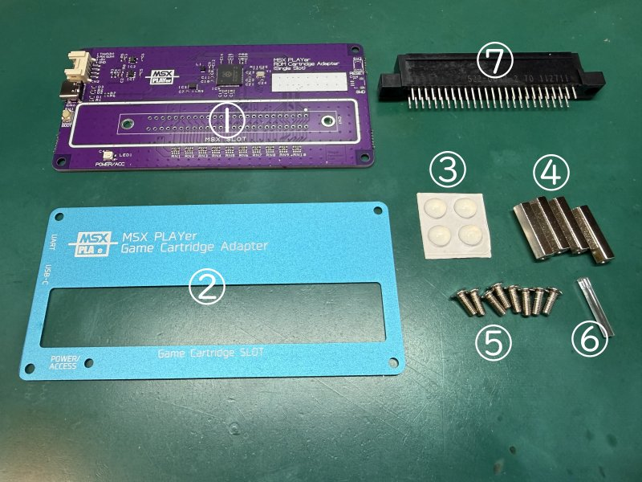

## 組み立て方法

### 1.カードエッジコネクタの半田付け (半田付けキット版のみ)

カードエッジコネクタを半田付けします。コネクタには方向はありません。  
取り付けの際は、基板との隙間が空かない様に注意してください。  
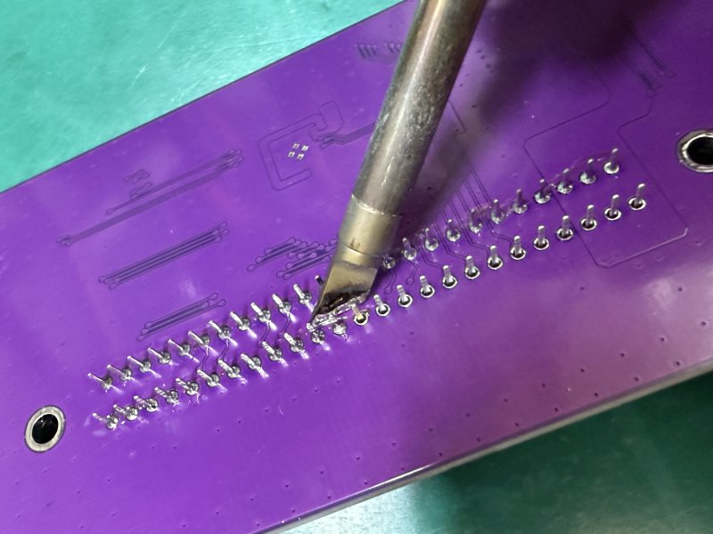

始めに両端の端子を半田付けして浮きが無いか確認してから他の端子を半田付けをすると、確実だと思います。  
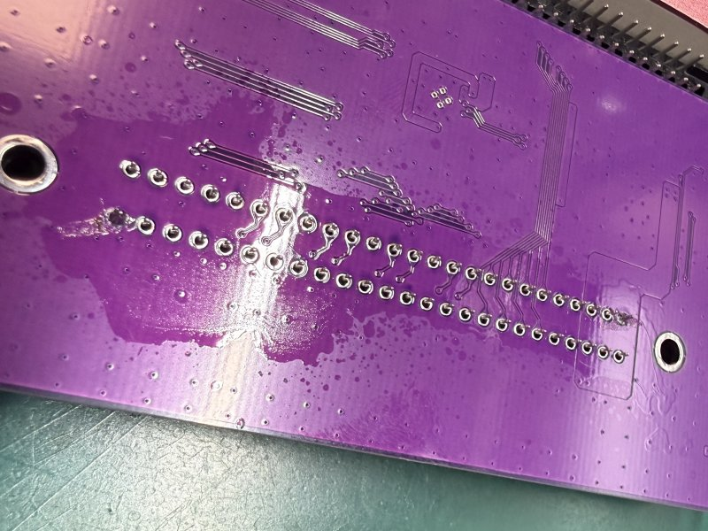

付属のコネクタがヒロセ製の場合、そのままでは少し足が長いので余分な部分はニッパーを使いカットします。  
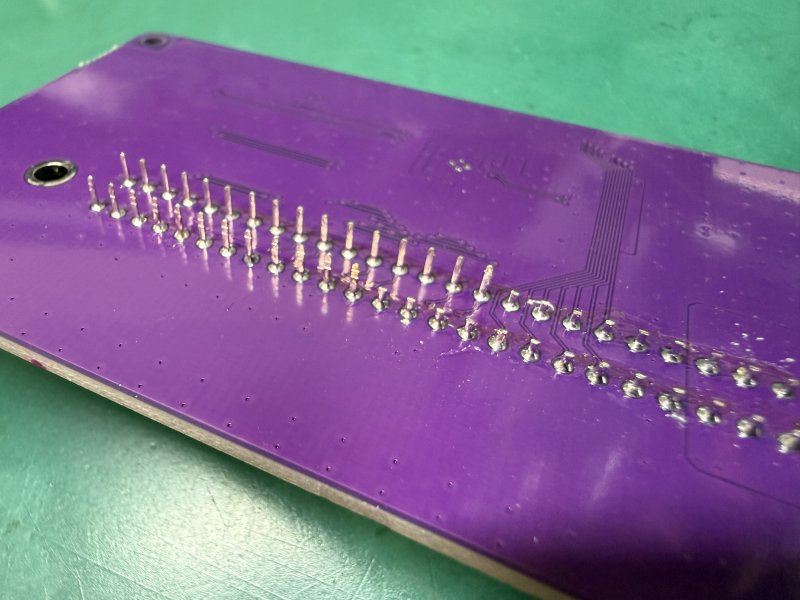

### 2.ライトパイプの取り付け

パネルにライトパイプを押し込みます。平らな面を先にしパネル表面から当該パーツを挿入し、隙間が無くなるまで押し込みます。  
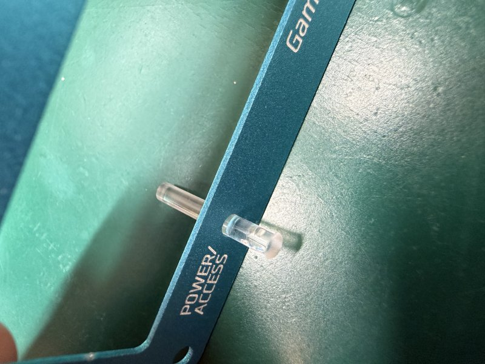
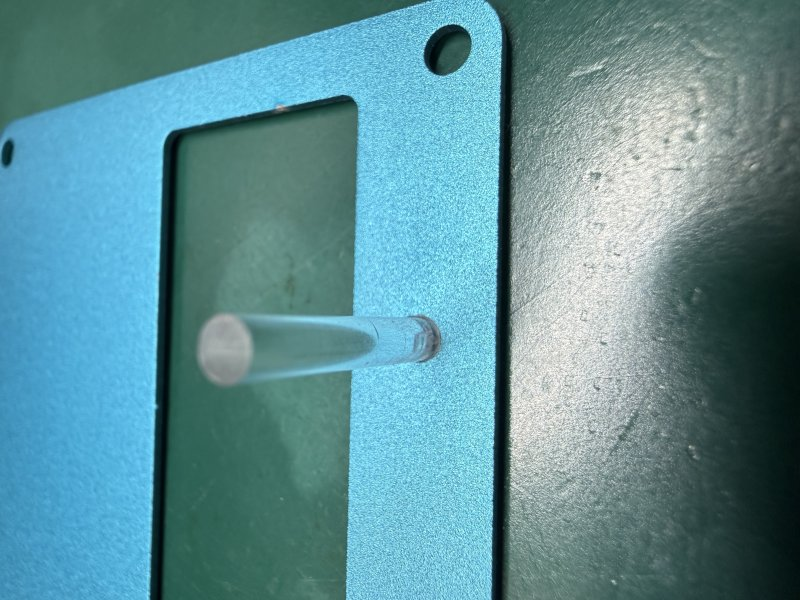

### 3.スペーサーの取り付け(表)

パネル表側をネジ止めしてスペーサを取り付けます。  
最後に微調整をするので、このときは軽く締める程度にして置く方が良いです。  
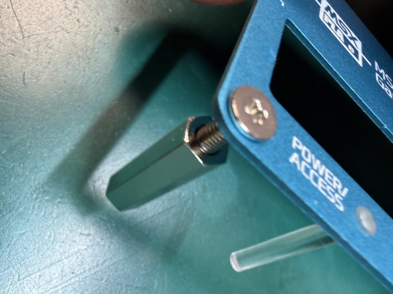

### 4.スペーサーの取り付け(裏)

スペーサの上に基板を載せネジ止めします。基板の向きに注意してください。
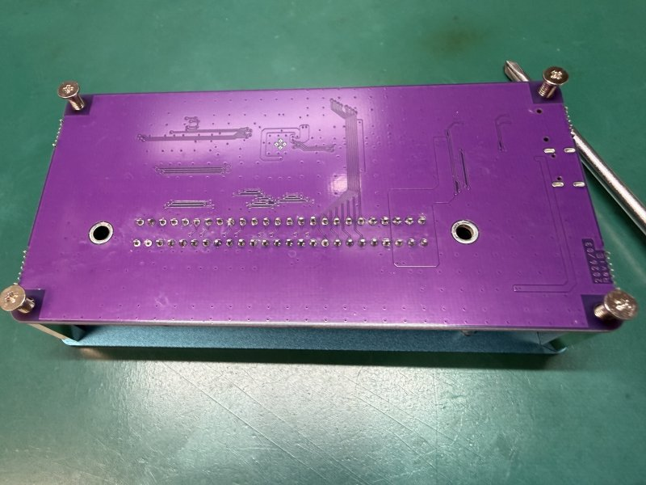
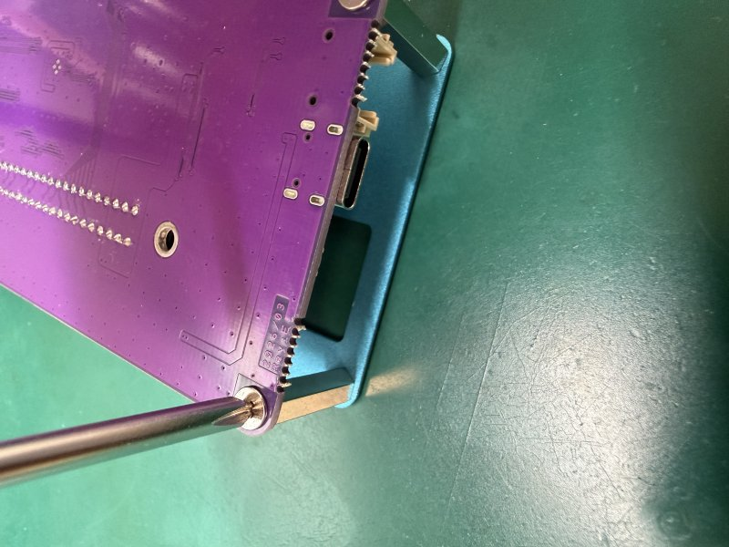

裏面ネジを4本を締めおわったら、表のネジ4本についても本締めしてください。  
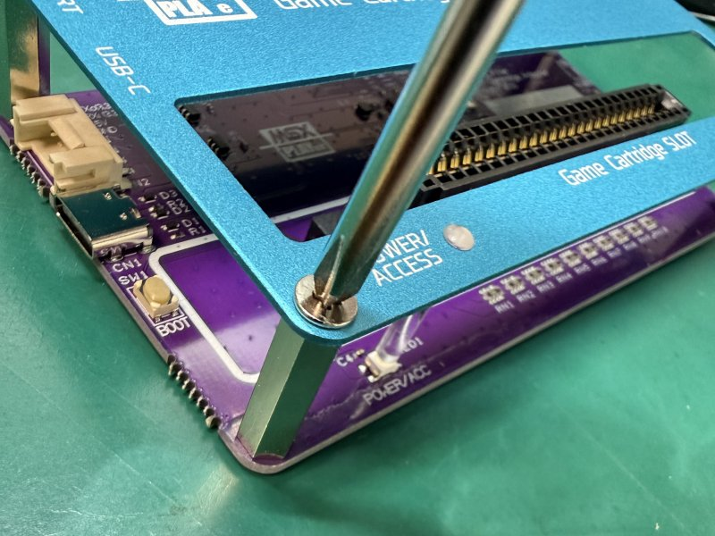

### 5.ゴム足の貼り付け

裏面の基板、ネジ近辺の4カ所にゴム足を貼り付けます。  
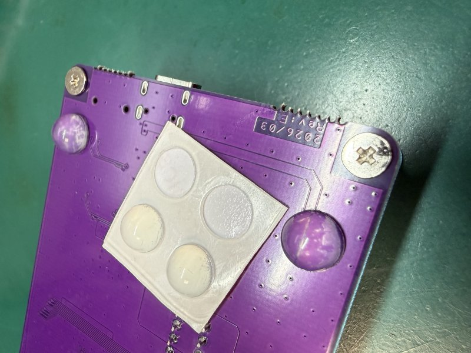

これにてすべての作業が完了です。お疲れ様でした。  

## 動作チェック (Windows向け)  

下記ファイルをダウンロードの上、MSXのカセットを本機に挿して、プログラムを実行してください。  
正常に動作した場合は、下記の様にカセットの0x4000から内容が表示されます。  

**動作チェックプログラム** [MSXPLAYer Game Cassette Adapter動作確認プログラム](./SOFTWARE/TestProgram/)  

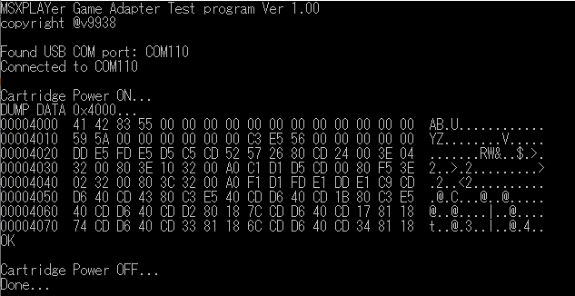

---

## 技術資料

### USB CDC コマンド仕様

[MSXPLAYer Game Cassette Adapterコマンド仕様](./com_command.md)  

### サンプルプログラム  

Windows向け：(VC++2019/2026で動作確認済)  

- **Game Cartridgeダンプサンプル:**  [ROMカセットDUMPプログラム](./SOFTWARE/MSXCR_ROMDUMPER/)
- **Script Engineサンプル:** [MSX_SimpleCartridge書き込みプログラム](./SOFTWARE/SimpleROM64KWriter/)  
　　対応cartridge:[https://github.com/v9938/MSX_SimpleCartridge](https://github.com/v9938/MSX_SimpleCartridge)  

## ファームウェアについて

下記フォルダーにコンパイル済のファームを置いてあります。  

[ファームウェア置き場](./FIRMWARE/UF2)

## ファームウェアアップデートについて

2種類の方法があります。

- BOOTスイッチを使う方法
BOOTスイッチを押しながら、USBケーブルを挿入してBOOTモードにします。
RP2350の名称のドライブが現れるので上記ファイルをCOPYしてください。  

- Firmware Update用ツールを使う方法  
FFU支援ツールとして`msxcr_ffu.exe`を提供しています。  
上記FFUフォルダーに置いてあるバッチファイル`ffu.bat`を実行するとFirmwareがUpdateされます。  

### ファイル構成（概要）

- `main.c`
  - USB CDC受信（行バッファ → パース）
  - コマンドキュー（Core0→Core1）
  - Slot Memory / IO の Read/Write
  - BRCV受信（バイナリ受信モード）
  - BSND送信（バイナリ送信キュー）
  - LED制御（WS2812）
  - Factory Test（GPIOテスト）
  - Script Engine（executeCommands）
- `commands.c / commands.h`
  - コマンド名 → 実行関数（cmd_*）のテーブル（公開コマンド一覧）
- `ports.c / ports.h`
  - GPIO 定義（`board_pins[]`）
- `ws2812.pio`
  - WS2812制御用PIOプログラム(from SDK pico-examples)
- `pwm_low_hiz.pio`
  - Slot Clock用PIO（LOW→Hi-Z）
- `usb_descriptors.c / tusb_config.h`
  - USB CDCのdescriptor/buffer設定

### ファームウェア動作概要（データフロー）

1. PCからUSB CDCでテキストコマンド送信（例: `SMRD,1000\r\n`）
2. Core0が改行まで `lineBuf` に蓄積し、パースして `commandBufs[]` に投入
3. Core1が `cmd_table[]` から該当関数を探し `cmd_*()` を実行
4. 応答は `cdc_queue[]` に積まれ、Core0の `cdc_task()` がUSBへ送信

### ビルド

Visual Studio CodeのPIC-SDK2.20環境でコンパイルしています。  

## USB VID/PIDについて

MSXライセンスコーポレションの許諾の元 旧ASCII社のVIDとPIDの割り当てを受け使用しています。  
本製品を改変したものを製作する場合は、別のVID/PIDを使用する様にしてください。  

## 回路図  

[回路図 PDF](./PCB/MSXPLAYerCR_1SLOT_RevD.pdf)
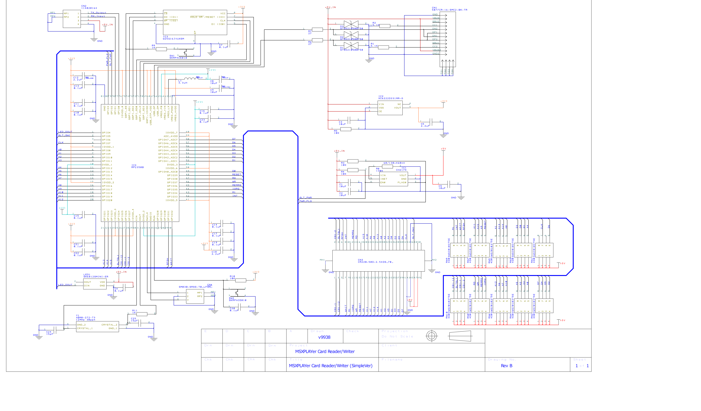

## PCBデータ

[Rev D ガーバデータ](./PCB/GARBER_DATA/)

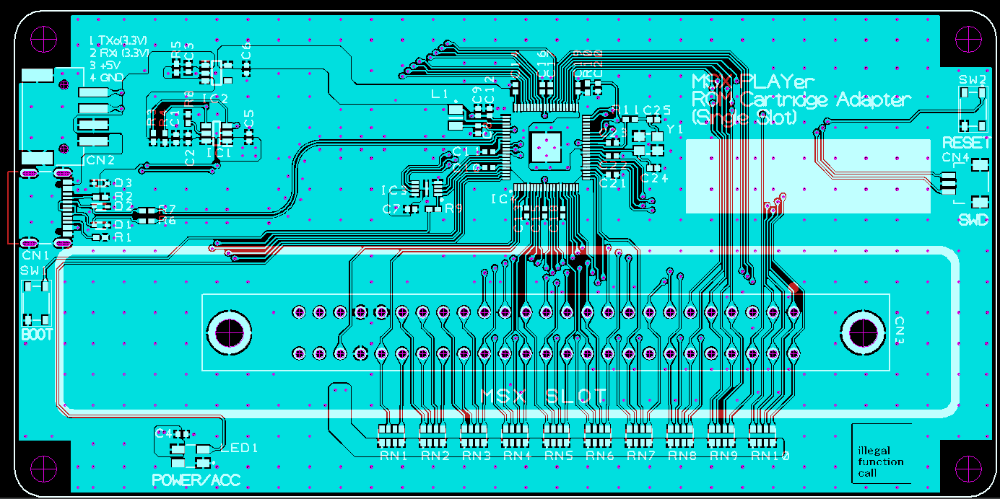

## BOM List

[Rev D PCBパーツリスト](./PCB/partslist_RevD.md)

## パネル  

[アルミパネルデータ](./PCB/PANEL_DATA/)

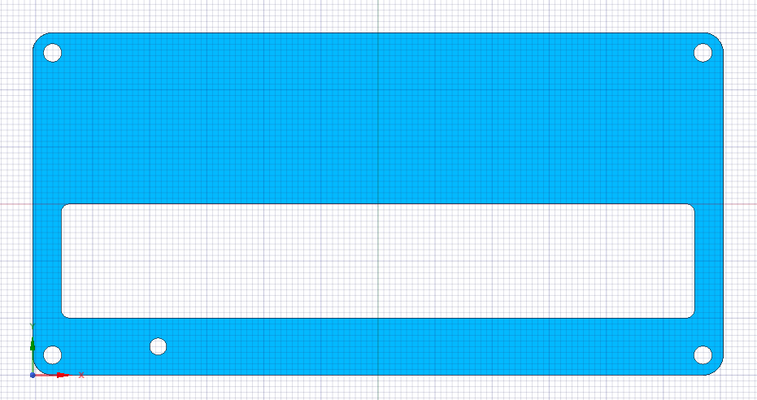

組み立てには、別途下記のパーツが必要です。  

|パーツ名|個数|入手先|
|---|---|---|
|φ3mm x 8mm ネジ|8|<https://www.hirosugi-net.co.jp/shop/g/g104024/>|
|φ3mm x 20mm スペーサー|4|<https://www.hirosugi-net.co.jp/shop/g/g670/>|
|ライトパイプ(VCC LFB075CTP)|1|<https://www.digikey.jp/ja/products/detail/visual-communications-company-vcc/LFB075CTP/5723594>|

## MSXPLAYerの名称／ロゴについて  

MSX および MSXPLAYerはMSXライセンスコーポレションの登録商標です。  

当方の頒布品につけているMSXPLAYerロゴについては、MSXアソシエーションとの開発協力下で当商品への使用が許諾されています。

## ライセンス

このプロジェクトはMIT ライセンスにて公開しています。

なお、コードの一部にRaspberryPiのpico-sdk v2.20よりコピーしたものを含みます。  
当該部分についてはBSD 3-Clause "New" or "Revised" Licenseが定める要件により、Raspberry Pi (Trading) Ltd.よりライセンスされたものです。  
